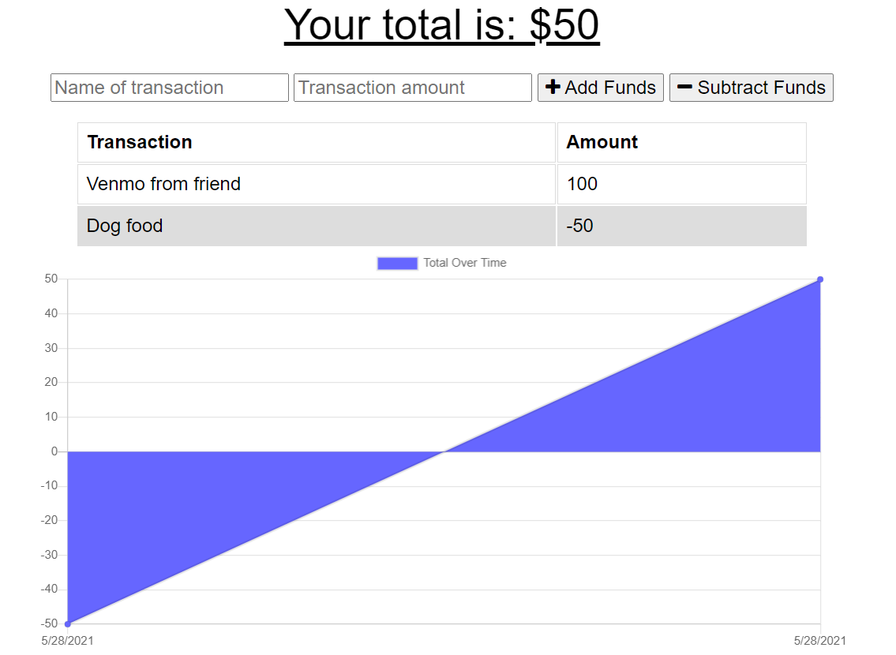

# Budget-Tracker

# Description
Added functionality to an existing Budget Tracker application to allow for offline access and functionality.  The user will be able to add expenses and deposits to their budget with or without a connection. When entering transactions offline, they should populate the total when brought back online.

# Technology used
Express, Mongoose, Service Worker, Javascript, and HTML

# Link to deployed application
https://limitless-fjord-72322.herokuapp.com/

